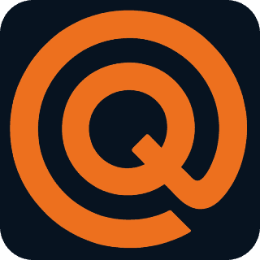

# 🏗️ Work In Progress
> This project is under construction. It's not finished.  
> The install instructions probably won't work yet.  

---
---

<br/><br/>

<div align="center"></div>

# 🪝 Quay

**Quay** is file-browser and outliner ui toolkit for the web. It provides a good user experience for interacting with files, folders, layers — any nested tree.

List-view or icons-view. Reorganize with drag-and-drop. Quick-search. Renaming things. Dropping files.

<br/>

## Quick-start OPFS file browser

Quay is a toolkit that can be used in many different ways.  
In this section, several different intergration examples are provided.  

### HTML technique
1. Install the script into your html `<head>`:
    ```html
    <script type="module">
      import * as Quay from "https://quay.e280.org/install.bundle.min.js"
      const opfs = new Quay.Opfs({allow: ["/"]})
      Quay.register(opfs.components())
    </script>
    ```
1. Place the outliner component anywhere in your html `<body>`:
    ```html
    <quay-outliner></quay-outliner>
    ```
1. Now you're done! Try it out, upload some files and play around.

### Web dev technique
1. Install the package into your project:
    ```sh
    npm i @e280/quay
    ```
1. Put this code into your js/ts app entrypoint (like "main.ts" or something):
    ```ts
    import * as Quay from "@e280/quay"
    const opfs = new Quay.Opfs({allow: ["/"]})
    Quay.register(opfs.components())
    ```
1. Place the outliner component anywhere in your html `<body>`:
    ```html
    <quay-outliner></quay-outliner>
    ```
1. It's ready, take it for a spin!

<br/>

## Hands-on custom integration

```ts
import * as Quay from "@e280/quay"

const file = Quay.make.file({label: "My cool file"})
const folder = Quay.make.folder({label: "My project", children: [file.id]})

const brain = new Quay.Brain({
  state: new Quay.State({
    rootId: folder.id,
    items: [folder, file],
  }),

  icons: Quay.icons.standard,
  theme: Quay.themes.standard,
  contextMenu: Quay.contextMenus.standard,

  allowSearch: true,
  allowRefresh: true,
  permissions: async item => Quay.permissions.all,

  actions: {
    newFolder: async folder => {},
    move: async move => {},
    search: async search => {},
    delete: async del => {},
    rename: async rename => {},
    refresh: async refresh => {},
    dragAndDrop: async dnd => {},
    upload: async upload => {},
  },
})

Quay.register(brain.components())
```

### Flexible permissions

Let's say you wanted to make a particular folder read-only

```ts
const restricted = Quay.make.folder({label: "Restricted"})

new Quay.Brain({
  ...stuff,

  permissions: async item => {
    if (item.id === restricted.id)
      return Quay.permissions.readOnly
    else
      return Quay.permissions.all
  },
})
```

In this way, you can setup sophisticated rules about what actions are permitted, and under whatever changing circumstances.

<br/>

## MediaLibrary

`MediaLibrary` is a small persistent media-bin preset.

```ts
import {MediaLibrary, brain, register, components} from "@e280/quay"

const media = await MediaLibrary.open("my-project")
brain.setGroup("media", media)

register(components)
```

```html
<div group="media">
  <quay-dropzone></quay-dropzone>
  <quay-browser></quay-browser>
</div>
```

The scope passed to `open()` separates media libraries.

```ts
const projectA = await MediaLibrary.open("project-a")
const projectB = await MediaLibrary.open("project-b")
```

<br/>

## Styling

Customize quay through its css vars

```css
:root {
  --quay-surface: #111;
  --quay-border: #222;
  --quay-text: #333;
  --quay-muted: #777;
  --quay-accent: #0ea5e9;
  --quay-radius: 6px;
}
```

You can scope those variables to one area or one component.

```css
.media-panel {
  --quay-surface: #18181b;
  --quay-border: #27272a;
}

quay-browser {
  --quay-browser-thumb-width: 120px;
  --quay-browser-thumb-height: 72px;
}
```

Public tokens:

```css
--quay-surface
--quay-surface-hover
--quay-surface-selected
--quay-border
--quay-text
--quay-muted
--quay-accent
--quay-radius
--quay-browser-thumb-width
--quay-browser-thumb-height
```

Quay is built on Shoelace, and its internal theme uses Shoelace tokens as fallbacks.
For deeper control, set Shoelace tokens in your app or scoped around Quay,
watch out for conflicts if you already use shoelace components in your app.

```css
.media-panel {
  --sl-color-primary-600: #575757;
  --sl-input-focus-ring-color: rgb(119 119 119 / 35%);
  --sl-border-radius-medium: 3px;
  --sl-spacing-x-small: 0.5em;
}
```
